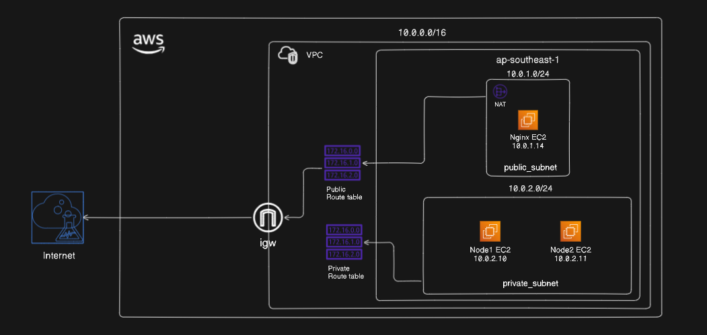

# Nginx Layer 4 Load Balancing on Node.js servers in AWS

This document outlines the process of setting up a layer 4 load-balanced Node.js application environment using Nginx. The setup consists of two identical Node.js applications, an Nginx server for load balancing. Here we will deploy it in AWS.



## Task
Create a load-balanced environment with two Node.js applications, Nginx as a load balancer, and a MySQL database, all running in AWS EC2 instance.


## Setup in AWS

### Create VPC, subnets, route table and gateways 

At first, we need to create a VPC in AWS, configure subnet, route tables and gateway.

- At first, we have created a VPC named `my-vpc`.

- Then, we have created 2 subnets: `public-subnet` and `private-subnet` in `my-vpc`.

- Creat necessary internet gateway, NAT gateways and route tables.

Here is the `resource-map` of our VPC:


### Create EC2 instance

We need to create `3 instances` in EC2. 

#### Create the NodeJS App EC2 Instances:
- Launch two EC2 instances (let's call them `node-app-1` and `node-app-2`) in our private subnet.
- Choose an appropriate AMI (e.g., Ubuntu).
- Configure the instances with necessary security group rules to allow HTTP/HTTPS traffic (typically port 80/443).
- Assign a key pair for SSH access.

#### Create the NGINX EC2 Instance:
- Launch another EC2 instance for the NGINX load balancer (let's call it `nginx-lb`) in our public subnet.
- Configure the instance with a security group to allow incoming traffic on the load balancer port (typically port 80/443) and outgoing traffic to the NodeJS servers.
- Assign a key pair for SSH access.


You need to SSH in the public instance to connect.

## Set up Node.js Applications

Connect to `node-app-1` and configure as follows:

### Create Node App 1

Install npm:
```sh
sudo apt update
sudo apt install npm
```

Then, 
```bash
mkdir Node-app
cd Node-app
npm init -y
npm install express
```

Create `index.js` in the Node-app-1 directory with the following code:

```javascript
const express = require('express');
const app = express();
const port = process.env.PORT;

app.get('/', (req, res) => {
  res.status(200).send(`Hello, from Node App on PORT: ${port}!`);
});

app.listen(port, () => {
  console.log(`App running on http://localhost:${port}`);
});
```


### Create Node App 2

Connect to the `Node-app-2` instance. 
Here, do the similar steps as `Node-app-1`.
 

### Start Node.js Applications
Navigate to each Node.js application directory and run:
```bash
export PORT=3001
node index.js
```

Do the same for both nodejs app instances. Make sure they are running and connected to the database properly. Note that, you need to set the `PORT=3002` in `Node-app-2` instance.


## Set up Nginx

Now, connect to teh `nginx` instance and create a `nginx.conf` file and a `Dockerfile`. You also need to install `Docker`. 

### Create Nginx Configuration
```bash
mkdir Nginx
cd Nginx
```

Create `nginx.conf` in the Nginx directory with the following configuration:

```nginx
events {}

stream {
    upstream nodejs_backend {
        server <Node-app-1 private-ip>:3001; # Node-app-1
        server <Node-app-2 private-ip>:3002; # Node-app-2
    }

    server {
        listen 80;

        proxy_pass nodejs_backend;

        # Enable TCP load balancing
        proxy_connect_timeout 1s;
        proxy_timeout 3s;
    }
}
```

Replace the pubic ip of nodejs app according to your ec2 instances.

This configuration sets up Nginx to act as a TCP load balancer, distributing traffic between the two Node.js applications. Let's break down the key components:

- `stream {}:` This block is used for TCP and UDP load balancing. It's different from the http {} block used in HTTP load balancing. It allows it to handle TCP and UDP traffic at the transport layer (Layer 4) of the OSI model.

- `upstream nodejs_backend {}:` This defines a group of backend servers. We're using host.docker.internal to refer to the host machine from within the Docker container. The ports 3001 and 3002 correspond to our two Node.js applications.

- `server {}:` This block defines the server configuration for the load balancer.
listen 80: This tells Nginx to listen on port 80 for incoming TCP connections.


This configuration provides a simple round-robin load balancing across our Node.js applications at the TCP level, which can be more efficient than HTTP-level load balancing for certain use cases.

### Create Dockerfile for Nginx
Create a file named `Dockerfile` in the Nginx directory with the following content:

```Dockerfile
FROM nginx:latest
COPY nginx.conf /etc/nginx/nginx.conf
```

### Build Nginx Docker Image
```bash
docker build -t custom-nginx .
```

This command builds a Docker image for Nginx with our custom configuration.

### Run Nginx Container
```bash
docker run -d -p 80:80 --name my_nginx custom-nginx
```

This command starts the Nginx container with our custom configuration.

## Verification

1. Visit `http://<nginx-public-ip>` in a web browser. You should see a response from one of the Node.js applications.

3. Refresh the browser or make multiple requests to observe the load balancing in action. You should see responses alternating between Node app 1 and Node app 2 running on different port.

    Example:

    
   
    

## Conclusion

By configuring Nginx with the stream module as described, you have effectively set up Nginx as a `Layer 4 load balancer`. It handles TCP connections based on IP addresses and port numbers, making routing decisions at the transport layer without inspecting higher-layer protocols like HTTP. This setup is suitable for scenarios where efficient TCP load balancing across multiple backend services is required.