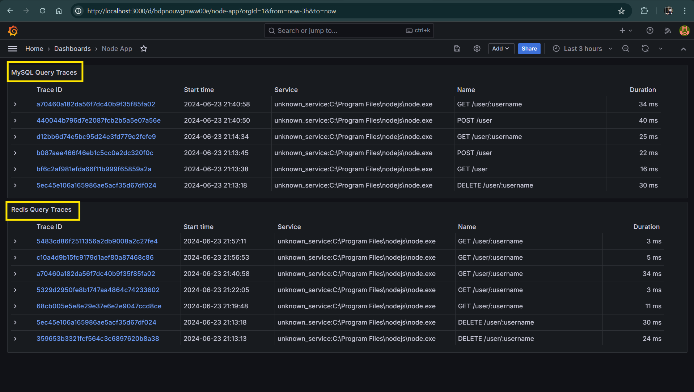
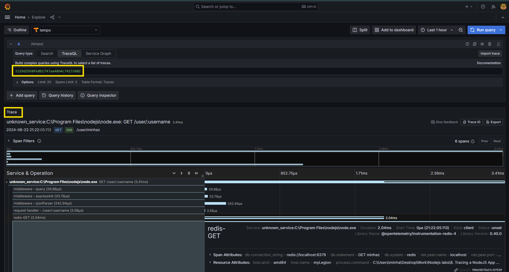
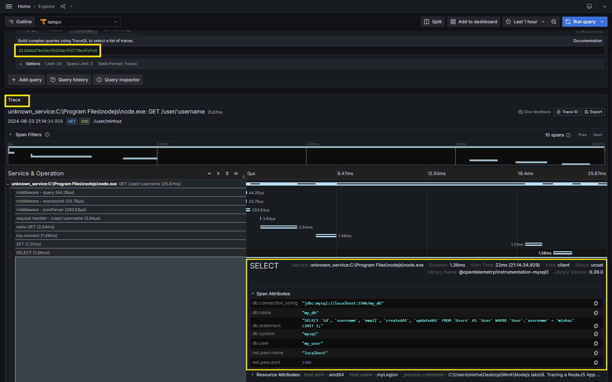

# Tracing with OpenTelemetry and Grafana Tempo in a NodeJS-Redis-MySQL App

Tracing is a method to monitor and track requests as they traverse through various services and systems. This guide will help you set up distributed tracing in a Node.js application using OpenTelemetry and Grafana Tempo. 

## Prerequisites
- Docker and Docker Compose installed on your system.
- Basic knowledge of Node.js, Express.js, and SQL/NoSQL databases.


## Project File Structure

### Create a Project Directory
Create a directory for your Node.js application and navigate into it:

```bash
mkdir tracing_nodejs_app
cd nodejs_app
npm init -y
```
This sets up a new directory for your Node.js project. The npm init -y command creates a package.json file with default settings.

Here is the structure of the project files:

```
tracing_nodejs_app/
├── config/
│   ├── database.js
│   └── redis.js
├── models/
│   └── User.js
├── tracing.js
├── index.js
├── docker-compose.yml
├── otel-collector-config.yml
├── tempo.yaml
└── package.json
```

## Package Installation

Create a `package.json` file in your project root with the following content:

```json
{
  "name": "tracing_nodejs_app",
  "version": "1.0.0",
  "description": "",
  "main": "index.js",
  "scripts": {
    "start": "node index.js",
    "test": "echo \"Error: no test specified\" && exit 1"
  },
  "keywords": [],
  "author": "",
  "license": "ISC",
  "dependencies": {
    "@opentelemetry/sdk-node": "^0.52.1",
    "@opentelemetry/exporter-otlp-grpc": "^0.26.0",
    "@opentelemetry/auto-instrumentations-node": "^0.47.1",
    "express": "^4.19.2",
    "mysql2": "^3.10.1",
    "redis": "^4.6.14",
    "sequelize": "^6.37.3"
  }
}
```

Install the necessary packages using the following command:

```bash
npm install
```

## Set Up Docker Compose
We'll start by setting up our Docker Compose file to define the services: MySQL, Redis, OpenTelemetry Collector, Grafana Tempo, and Grafana.

Create a `docker-compose.yml` file in the project root:

```yaml
version: '3.8'

services:
  mysql:
    image: mysql:latest
    container_name: mysql
    environment:
      MYSQL_ROOT_PASSWORD: root
      MYSQL_DATABASE: my_db
      MYSQL_USER: my_user
      MYSQL_PASSWORD: my_password
    ports:
      - "3306:3306"
    volumes:
      - mysql_data:/var/lib/mysql

  redis:
    image: redis/redis-stack:latest
    container_name: redis
    ports:
      - "6379:6379"
      - "8001:8001"
    volumes:
      - redis_data:/data

  otel-collector:
    image: otel/opentelemetry-collector-contrib
    container_name: otel-collector
    ports:
      - "4317:4317"
      - "55681:55681"
    volumes:
      - ./otel-collector-config.yml:/etc/otel-collector-config.yml
    command:
      --config etc/otel-collector-config.yml

  tempo:
    image: grafana/tempo:latest
    container_name: tempo
    ports:
      - "3100:3100"
    volumes:
      - ./tempo.yaml:/etc/tempo.yaml
    command:
      -config.file=/etc/tempo.yaml

  grafana:
    image: grafana/grafana:latest
    container_name: grafana
    ports:
      - "3000:3000"
    environment:
      - GF_SECURITY_ADMIN_PASSWORD=admin
    depends_on:
      - tempo

volumes:
  mysql_data:
  redis_data:
```

This file sets up the services required for our application, including the OpenTelemetry collector, Grafana Tempo, and Grafana. 


## Configure MySQL and Redis Connections

**MySQL Configuration (`config/database.js`):**

```js
const { Sequelize } = require('sequelize');

const sequelize = new Sequelize('my_db', 'my_user', 'my_password', {
  host: 'localhost',
  dialect: 'mysql',
});

module.exports = sequelize;
```

**`config/redis.js`:**
```javascript
const redis = require('redis');
const client = redis.createClient({
  url: 'redis://localhost:6379'
});

client.connect().catch(console.error);

client.on('error', (err) => {
  console.error('Redis error:', err);
});

module.exports = client;
```

These configurations connect the Node.js application to MySQL and Redis instances.


## Define User Model
Create a User model to interact with the MySQL database:

**`models/User.js`:**

```js
const { DataTypes } = require('sequelize');
const sequelize = require('../config/database');

const User = sequelize.define('User', {
  username: {
    type: DataTypes.STRING,
    allowNull: false,
  },
  email: {
    type: DataTypes.STRING,
    allowNull: false,
  },
});

module.exports = User;
```

## Set Up Tracing with OpenTelemetry
Configure OpenTelemetry to collect traces from the Node.js application:

**`tracing.js`:**
```js
const { NodeSDK } = require('@opentelemetry/sdk-node');
const { OTLPTraceExporter } = require('@opentelemetry/exporter-otlp-grpc');
const { getNodeAutoInstrumentations } = require('@opentelemetry/auto-instrumentations-node');

const traceExporter = new OTLPTraceExporter({
  url: 'http://localhost:4317',
});

const sdk = new NodeSDK({
  traceExporter,
  instrumentations: [getNodeAutoInstrumentations()],
});

sdk.start();
```

This script initializes OpenTelemetry, setting up an OTLP trace exporter to send trace data to the OpenTelemetry Collector.


## Configure Grafana Tempo
Configure Grafana Tempo to receive and store trace data:

**`tempo.yaml`:**
```yaml
server:
  http_listen_port: 3100

distributor:
  receivers:
    otlp:
      protocols:
        grpc:
          endpoint: 0.0.0.0:4317

ingester:
  trace_idle_period: 30s
  max_block_bytes: 1048576  # 1MiB in bytes

querier:
  frontend_worker:
    frontend_address: 127.0.0.1:9095

storage:
  trace:
    backend: local
    local:
      path: /tmp/tempo/traces

compactor:
  compaction:
    block_retention: 48h
```

This configuration sets up Grafana Tempo to listen for OTLP trace data on port 4317 and store traces locally.

## Configure OpenTelemetry Collector
Set up the OpenTelemetry Collector to receive traces and export them to Grafana Tempo:

**`otel-collector-config.yaml`:**
```yaml
receivers:
  otlp:
    protocols:
      grpc:
        endpoint: 0.0.0.0:4317
      http:
        endpoint: 0.0.0.0:4318

exporters:
  logging:
  otlp:
    endpoint: tempo:4317
    tls:
      insecure: true
  debug:
    verbosity: detailed

service:
  pipelines:
    traces:
      receivers: [otlp]
      processors: []
      exporters: [logging, otlp]

    metrics:
      receivers: [otlp]
      exporters: [debug]
    logs:
      receivers: [otlp]
      exporters: [debug]
```

This configuration sets up the OpenTelemetry Collector to receive traces on ports 4317 and 4318, and export them to Grafana Tempo.

## Set Up Express Application
Integrate tracing and define routes in the Express application:

**`index.js`:**
```javascript
require('./tracing');
const express = require('express');
const sequelize = require('./config/database');
const redisClient = require('./config/redis');
const User = require('./models/User');

const app = express();
app.use(express.json());

const cache = async (req, res, next) => {
  const { username } = req.params;
  try {
    const data = await redisClient.get(username);
    if (data) {
      return res.json(JSON.parse(data));
    } else {
      next();
    }
  } catch (err) {
    console.error('Redis error:', err);
    next();
  }
};

const invalidateCache = async (req, res, next) => {
  const { username } = req.params;
  if (username) {
    try {
      await redisClient.del(username);
    } catch (err) {
      console.error('Redis error:', err);
    }
  }
  next();
};

app.get('/', (req, res) => {
  res.send('Hello World!');
});

app.get('/user', async (req, res) => {
  try {
    const users = await User.findAll();
    res.json(users);
  } catch (error) {
    res.status(500).json({ error: error.message });
  }
});

app.get('/user/:username', cache, async (req, res) => {
  try {
    const { username } = req.params;
    const user = await User.findOne({ where: { username } });

    if (user) {
      await redisClient.setEx(username, 3600, JSON.stringify(user));
      res.json(user);
    } else {
      res.status(404).send('User not found');
    }
  } catch (error) {
    res.status(500).send(error.message);
  }
});

app.post('/user', async (req, res) => {
  try {
    const { username, email } = req.body;
    const newUser = await User.create({ username, email });
    res.status(201).json(newUser);
  } catch (error) {
    res.status(500).send(error.message);
  }
});

app.put('/user/:username', invalidateCache, async (req, res) => {
  try {
    const { username } = req.params;
    const { email } = req.body;
    const user = await User.findOne({ where: { username } });

    if (user) {
      user.email = email;
      await user.save();
      await redisClient.setEx(username, 3600, JSON.stringify(user));
      res.json(user);
    } else {
      res.status(404).send('User not found');
    }
  } catch (error) {
    res.status(500).send(error.message);
  }
});

app.delete('/user/:username', invalidateCache, async (req, res) => {
  try {
    const { username } = req.params;
    const user = await User.findOne({ where: { username } });

    if (user) {
      await user.destroy();
      await redisClient.del(username);
      res.status(204).send();
    } else {
      res

.status(404).send('User not found');
    }
  } catch (error) {
    res.status(500).send(error.message);
  }
});

const startServer = async () => {
  try {
    await sequelize.sync({ force: true });
    app.listen(5000, () => {
      console.log('Server is running on http://localhost:5000');
    });
  } catch (error) {
    console.error('Unable to connect to the database:', error);
  }
};

startServer();
```
This file sets up the Express application with routes for user management, integrates Redis caching, and starts the server.


## Run the Application

Start the application using Docker Compose:

```bash
docker-compose up
```

This command will build and start all services defined in the `docker-compose.yml` file. Make sure all containers are up and running.

To start the Node.js server separately, use:

```bash
npm start
```

This command will start all the nodejs services at `htttp://localhost:5000`.

## Access Grafana

Once the application is running, access Grafana at `http://localhost:3000` and log in with the default credentials (`admin`/`admin`).

### Configure Data Source in Grafana

1. Navigate to **Configuration** > **Data Sources**.
2. Click on **Add data source**.
3. Select **Tempo** from the list.
4. Configure the URL as `http://tempo:3100`.
5. Click **Save & Test** to ensure the connection is working.

### Create Dashboards and Panels

1. Navigate to **Create** > **Dashboard**.
2. Add a new panel and configure it to visualize traces.
3. Use the data source you just configured (Tempo) to query and display trace data.

### Trying different queries

wehave tried some different queries regarding http `methods` and `status code`. wehave also made some panels in dashboard. 

Here are the TraceQL queries:

1. TraceQL query for Successful HTTP requests (`2xx` status codes):

    ```sql
    { span.http.status_code >= 200 && span.http.status_code < 300 }
    ```

2. TraceQL for client error HTTP requests (`4xx` status codes):

    ```sql
    { span.http.status_code >= 400 && span.http.status_code <500 }
    ```

3. TraceQL query for HTTP `GET` requests:

    ```sql
    { span.http.method = "GET" }
    ```

4. TraceQL query for HTTP `POST` requests:

    ```sql
    { span.http.method = "POST" }
    ```


We have some panels here in our dashboard created from these queries:


The image shows a Grafana dashboard with multiple panels, each displaying metrics related to HTTP requests.
- Successful HTTP requests (2xx status codes).
- Client error HTTP requests (4xx status codes).
- HTTP GET requests.
- HTTP POST requests.


### Displaying Trace data

Now go to **`Menu`** > **`Explore`**. Here let's try to trace the `MySQL` and `Redis` from our server using some query.

1. TraceQL query for Redis query data:

    ```
    { span.db.system = "redis" }
    ```

2. TraceQL query for MySQL query data:

    ```
    { span.db.system = "mysql" }
    ```

We have added the trace tables of a particular query in a different dashboard:



If we click on any of the TraceID, we will see the trace information in details:

Here is one example for a redis query trace:



Here is another example for a MySQL query trace:



## Summary
We have now set up a Node.js application with distributed tracing using OpenTelemetry and Grafana Tempo. The traces collected from our application are sent to the OpenTelemetry Collector, which then forwards them to Grafana Tempo for storage and visualization. By following these steps, we can monitor and analyze the performance and behavior of our distributed system.